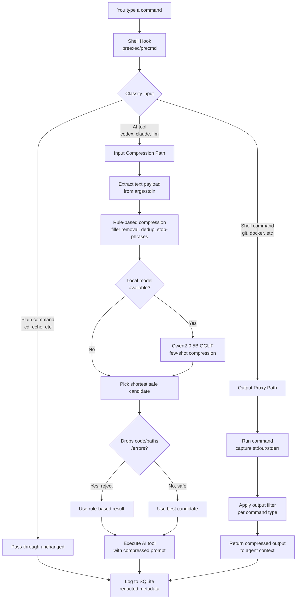
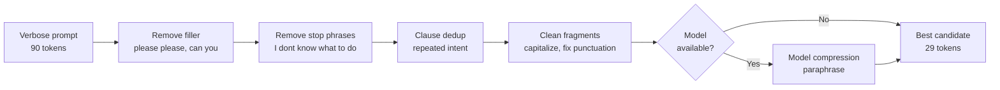
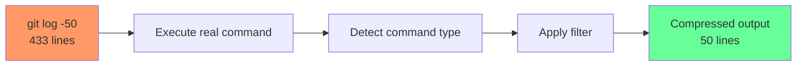
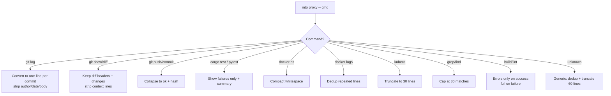
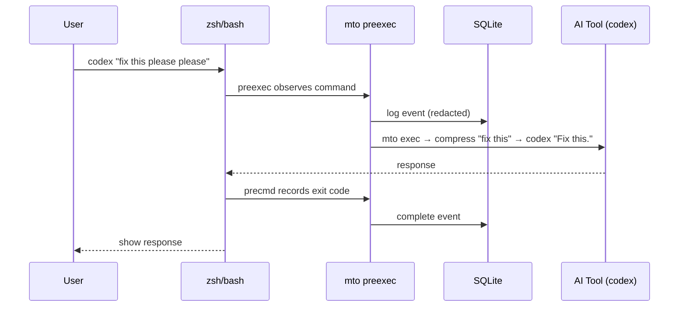
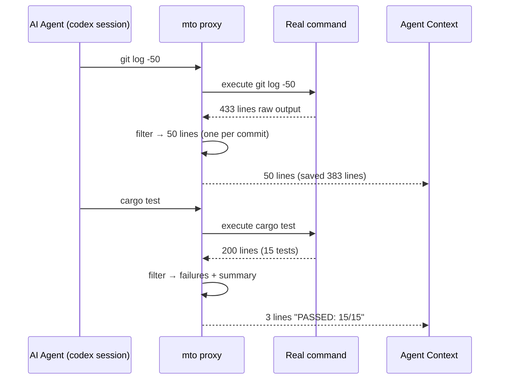

# System Flow

## Overview

mto operates in two directions: compressing **inputs** (your prompts to AI tools) and compressing **outputs** (command results back to the agent).

## Full System Flow

## Input Compression Pipeline

## Output Proxy Pipeline

## Per-Command Output Filters

## Shell Hook Architecture

## Agent Session with Proxy

